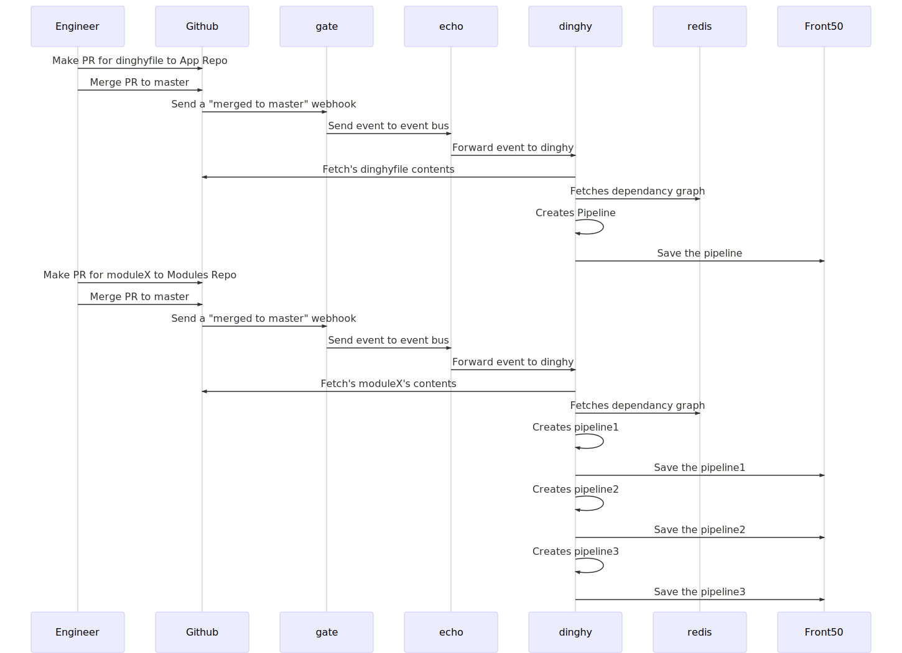

# dinghy

_A little boat to take you to the big boat_ - Miker

## Yo, but what do it do?

Users should be able to specify a pipeline in code in their GitHub repo. Dinghy should keep the pipeline in Spinnaker in sync with what is in the GitHub repo. Also, users should be able to make a pipeline by composing other pipelines, stages, or tasks and templating certain values.

### Deets

There are two primitives:
- Stage/Task templates: These are all kept in a single GitHub repo. They are json files with replacable values in them.
- Pipeline definitions: These define a pipeline for an application. You can compose stage/task templates to make a full definition.

How it works:
- GitHub webhooks are sent off when either the templates or the definitions are modified.
- Templates should be versioned by hash when they are used.
- Dinghy will keep a dependency graph of downstream templates. When a dependency is modified, the pipeline definition will be rebuilt and re-posted to Spinnaker. (sound familiar? haha)

<!-- made using ./bin/makeDiagrams.sh -->

### Testing manually.

curl -X POST -H "Content-Type: application/json" -d "@example/github_payload.json" http://localhost:8089/webhooks/git/github

(The github_payload.json file in the example directory is a minimal set for
testing the git webhook, as an example)

